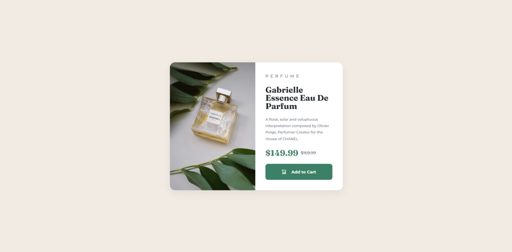

# Frontend Mentor - Product preview card component solution

This is a solution to the [Product preview card component challenge on Frontend Mentor](https://www.frontendmentor.io/challenges/product-preview-card-component-GO7UmttRfa). Frontend Mentor challenges help you improve your coding skills by building realistic projects. 

## Table of contents

- [Overview](#overview)
  - [The challenge](#the-challenge)
  - [Screenshot](#screenshot)
  - [Links](#links)
- [My process](#my-process)
  - [Built with](#built-with)
  - [What I learned](#what-i-learned)
  - [Continued development](#continued-development)
  - [Useful resources](#useful-resources)
- [Author](#author)
- [Acknowledgments](#acknowledgments)

**Note: Delete this note and update the table of contents based on what sections you keep.**

## Overview

### The challenge

Users should be able to:

- View the optimal layout depending on their device's screen size
- See hover and focus states for interactive elements

### Screenshot

### Links

- [Solution URL](https://your-solution-url.com)
- [Live Site URL](https://ahmadfaa1z.github.io/Frontend-Mentor-Challenges/product-preview-card-component/index.html)

## My process

### Built with
- Semantic HTML5 markup
- CSS custom properties
- Flexbox
- Media-queries
- Desktop-first workflow

### Continued development

I had done this project some time ago but have not completed the mobile design. Hoping to improve on the mobile design (and mobile-first approach).

### Useful resources
- [Shadow Examples](https://getcssscan.com/css-box-shadow-examples)
- [Interactive guide to flexbox](https://www.joshwcomeau.com/css/interactive-guide-to-flexbox/)

## Author
- Frontend Mentor - [@ahmadfaa1z](https://www.frontendmentor.io/profile/ahmadfaa1z)
