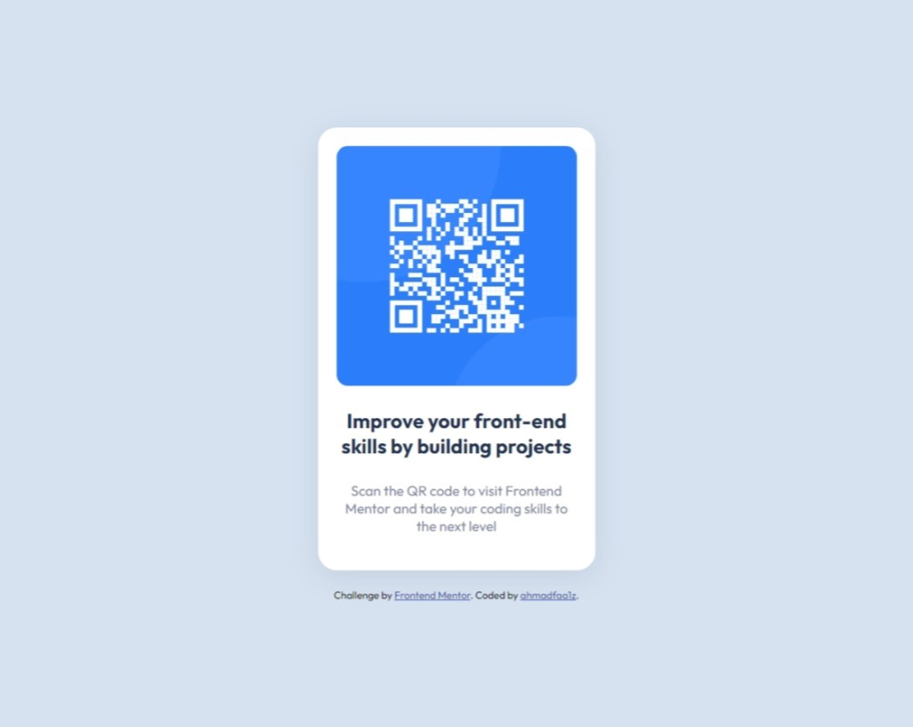

# Frontend Mentor - QR code component solution

This is a solution to the [QR code component challenge on Frontend Mentor](https://www.frontendmentor.io/challenges/qr-code-component-iux_sIO_H). Frontend Mentor challenges help you improve your coding skills by building realistic projects. 

## Table of contents

- [Overview](#overview)
  - [Screenshot](#screenshot)
  - [Links](#links)
- [My process](#my-process)
  - [Built with](#built-with)
  - [What I learned](#what-i-learned)
  - [Useful resources](#useful-resources)
- [Author](#author)

## Overview

### Screenshot



### Links

- Solution URL: [QR Code Component - Code](https://github.com/ahmadfaa1z/Frontend-Mentor-Challenges/tree/master/qr-code-component)
- Live Site URL: [QR Code Component - Live Site](https://ahmadfaa1z.github.io/Frontend-Mentor-Challenges/qr-code-component/index.html)

## My process

### Built with
- Semantic HTML5 markup
- CSS custom properties
- Flexbox

### What I learned

I added a div container to set the margin for the container elements... although I think I can set the margin for each element separately.
```html
<main>
  <div id="container">
    ...
  </div>
</main>
```
This css will let any child elements of the body be placed in the center of the webpage using Flexbox (There are other methods too).
```css
body {
  height: 100vh;
  margin: 0;
  display: flex;
  justify-content: center;
  align-items: center;
  flex-direction: column;
  overflow: hidden;
  background-color: hsl(212, 45%, 89%);
}
```

### Useful resources

- [Flex Image Wont Shrink](https://stackoverflow.com/questions/50542773/flex-image-wont-shrink-with-screen-size-when-container-is-a-hyperlink) - I had a problem with the QR Code image not shrinking to the width I wanted. So this site helps me discover what was wrong with my code.

## Author
- Frontend Mentor - [@ahmadfaa1z](https://www.frontendmentor.io/profile/ahmadfaa1z)